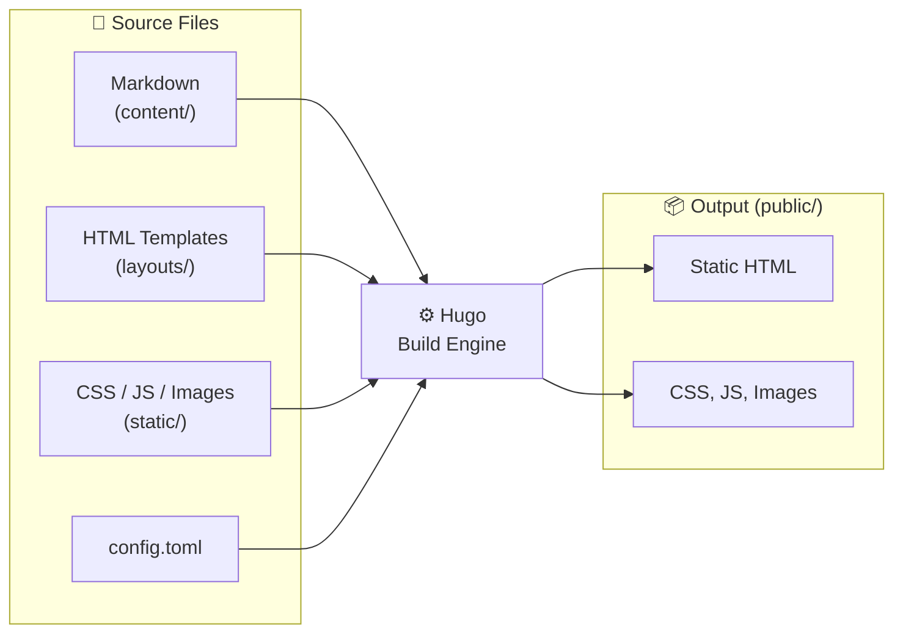
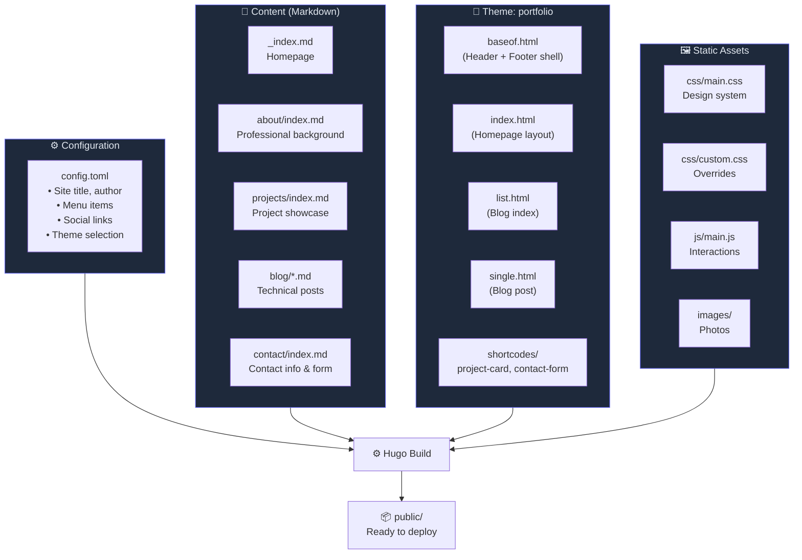
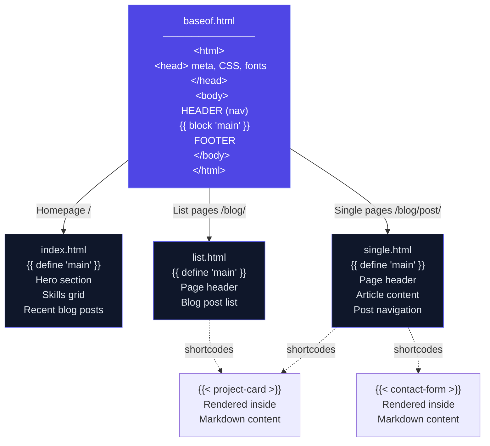

# Shivanshu Singla — Personal Portfolio

A modern, responsive portfolio website built with [Hugo](https://gohugo.io/) and auto-deployed to GitHub Pages.

**Live:** [shivanshu27.github.io/my-personal-website](https://shivanshu27.github.io/my-personal-website/)

---

## How Hugo Works (Concepts)

Hugo is a **static site generator** — it takes your Markdown content + HTML templates and compiles them into plain HTML/CSS/JS files that any web server can host. No database, no backend runtime.



### Key Concepts

| Concept | What it means |
|---------|--------------|
| **Content** | Markdown files in `content/` — each file becomes a page |
| **Front Matter** | YAML/TOML metadata at the top of each `.md` file (`title`, `date`, `tags`) |
| **Templates** | Go HTML templates in `layouts/` — define how content is rendered |
| **Shortcodes** | Reusable HTML snippets you embed in Markdown (``) |
| **Theme** | A bundled set of templates + assets (ours lives in `themes/portfolio/`) |
| **baseURL** | The root URL of the site — Hugo prepends this to all links |
| **Static** | Files in `static/` are copied as-is to the output (images, CSS, JS) |

---

## How This Project is Structured



---

## Template Rendering Flow

When Hugo builds a page, it uses a **template inheritance** model:



---

## CI/CD & Deployment Pipeline


**Pipeline steps (`.github/workflows/hugo.yml`):**

1. **Trigger** — Push to `master` branch
2. **Checkout** — Clone repo with full history
3. **Setup Hugo** — Install latest Hugo extended edition
4. **Build** — Run `hugo --minify` → outputs to `./public/`
5. **Deploy** — Push `./public/` contents to `gh-pages` branch via `peaceiris/actions-gh-pages`
6. **Serve** — GitHub Pages automatically serves the `gh-pages` branch

---

## Tech Stack

| Layer | Technology |
|-------|-----------|
| Static Site Generator | Hugo |
| Theme | Custom `portfolio` theme (hand-built) |
| Styling | CSS custom properties, Inter + JetBrains Mono |
| Icons | Font Awesome 6 |
| Deployment | GitHub Pages via GitHub Actions |
| CI/CD | `.github/workflows/hugo.yml` — builds on push to `master`, deploys to `gh-pages` |

## Project Structure

```
my-personal-website/
├── config.toml                  # Site config (title, params, menus)
├── netlify.toml                 # Netlify config (optional fallback)
├── content/                     # All page content (Markdown)
│   ├── _index.md                # Homepage content
│   ├── about/index.md           # About page
│   ├── blog/                    # Blog posts
│   │   ├── _index.md
│   │   └── getting-started-with-hugo.md
│   ├── contact/index.md         # Contact page
│   └── projects/index.md        # Projects showcase
├── layouts/                     # Layout overrides
│   └── partials/
│       ├── head.html
│       └── header.html
├── static/                      # Static assets (served as-is)
│   ├── css/
│   │   ├── main.css             # Core stylesheet
│   │   └── custom.css           # Custom overrides
│   ├── images/
│   └── js/
│       └── main.js              # Client-side JS (menu, animations, form validation)
├── themes/portfolio/            # Custom Hugo theme
│   └── layouts/
│       ├── index.html           # Homepage template
│       ├── _default/
│       │   ├── baseof.html      # Base layout (header, footer, meta)
│       │   ├── list.html        # List pages (blog index, etc.)
│       │   └── single.html      # Single content pages
│       └── shortcodes/
│           ├── contact-form.html
│           └── project-card.html
└── .github/workflows/
    └── hugo.yml                 # CI/CD pipeline
```

## Local Development

### Prerequisites

- [Hugo](https://gohugo.io/installation/) v0.110.0 or later

### Run Locally

```bash
# Clone (uses SSH alias for personal GitHub account)
git clone git@github-shivanshu:Shivanshu27/my-personal-website.git
cd my-personal-website

# Start dev server with drafts enabled
hugo server -D

# Open http://localhost:1313/my-personal-website/
```

### Build for Production

```bash
hugo --minify
# Output in ./public/
```

## Deployment

Fully automated — every push to `master` triggers:

1. **GitHub Actions** (`.github/workflows/hugo.yml`) builds the site with `hugo --minify`
2. Built output is pushed to the `gh-pages` branch
3. **GitHub Pages** serves `gh-pages` at the live URL

No manual steps needed.

## Customization

### Site Config

Edit `config.toml` to change site title, description, social links, and navigation menu.

### Content

All pages live in `content/` as Markdown. Add new blog posts under `content/blog/`.

### Styling

- `static/css/main.css` — Design system (colors, layout, components)
- `static/css/custom.css` — Quick overrides

### Shortcodes

- `` — Project showcase card
- `` — Contact form (Netlify Forms compatible)

## License

MIT
