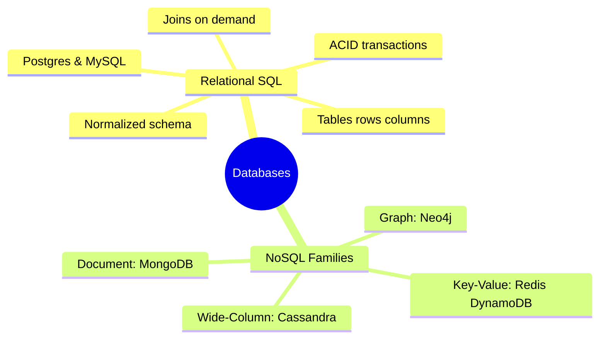
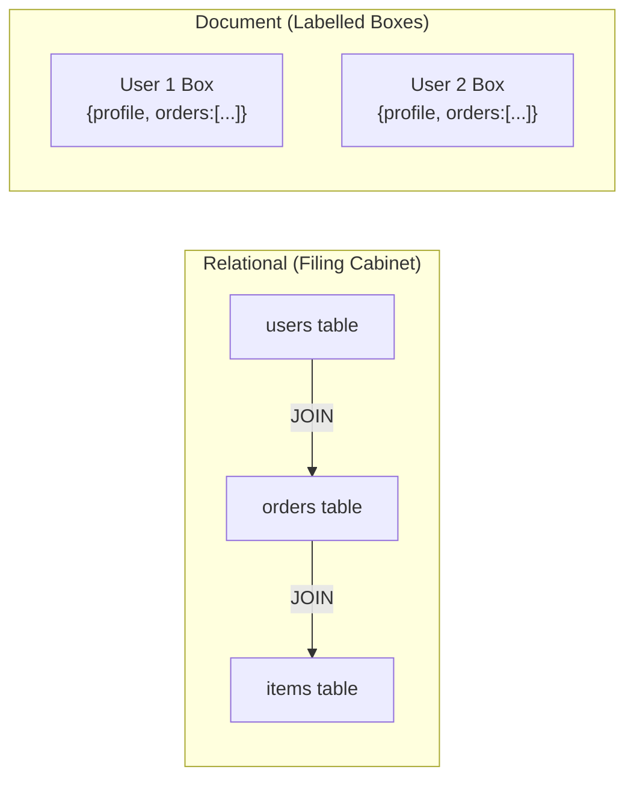
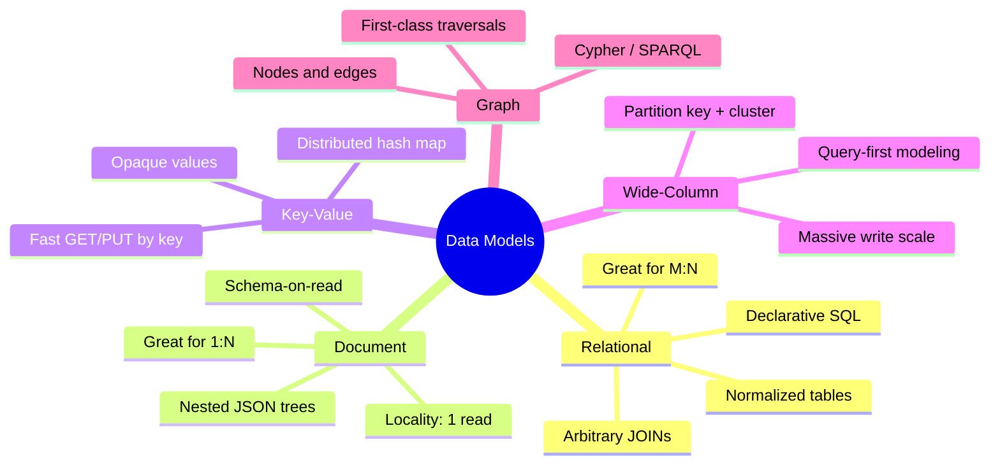
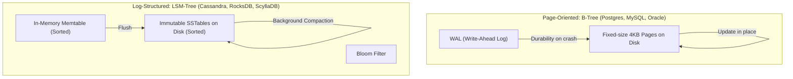
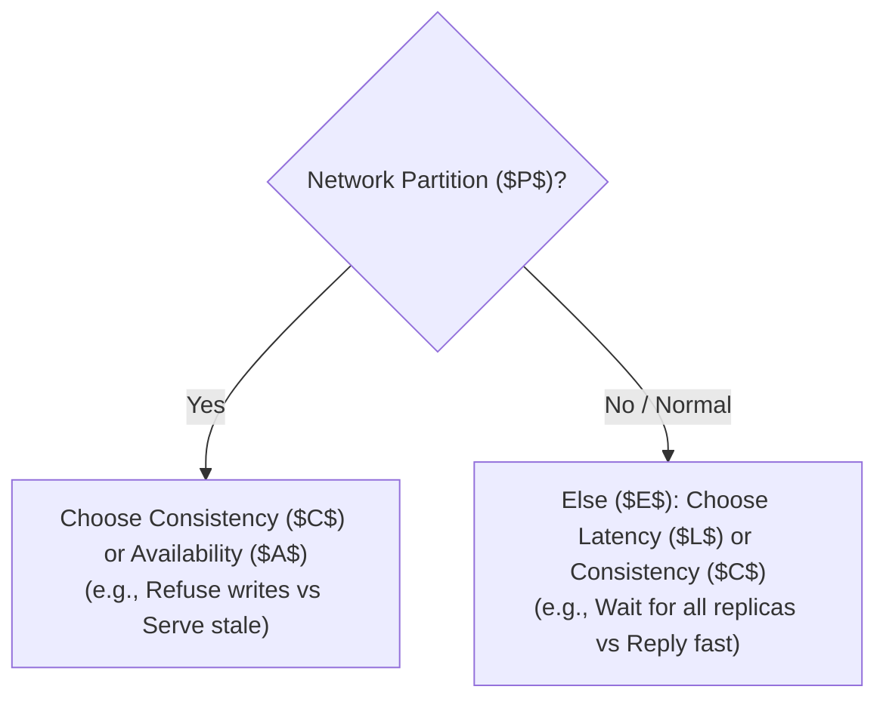
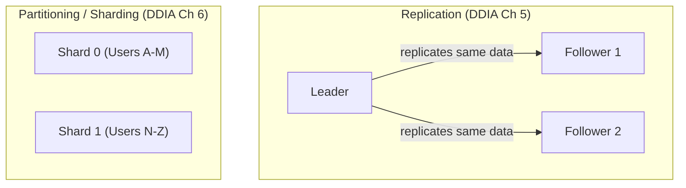
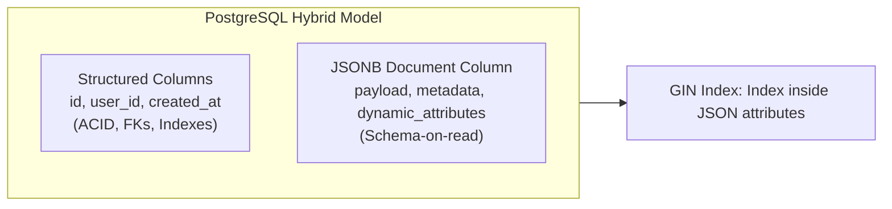
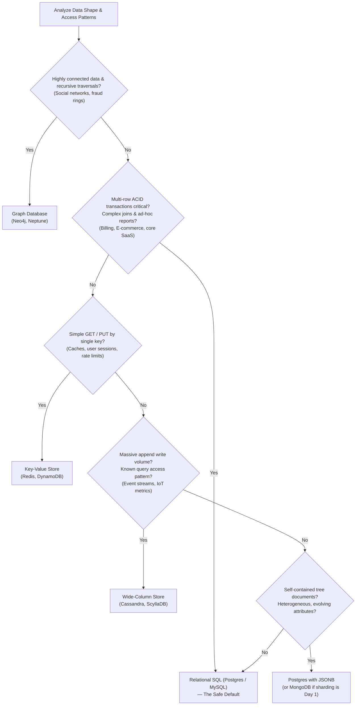

Every system you build stores state somewhere. Your microservices will be rewritten, your frontend frameworks will be deprecated, and your API contracts will evolve—but **the database outlives them all**. Once several terabytes of production data settle into a specific layout and consistency model, migrating away is one of the most painful, high-risk operations in engineering.

Yet, conversations around **SQL vs NoSQL** are too often treated like a religious war: *"SQL is legacy tech from the 1970s; NoSQL is modern, web-scale, and lightning fast."*

That framing is fundamentally broken.



As a senior software engineer, you don't pick a database because it's trendy. You pick a database based on four concrete axes:
1. **The shape of your data** (relational, tree, key-value, graph)
2. **Your read and write access patterns**
3. **Your consistency and transaction guarantees**
4. **The operational complexity at scale**

In this post, we’ll cut through the hype using the foundational principles from Martin Kleppmann’s *Designing Data-Intensive Applications* (DDIA) and real-world production lessons. We’ll look at the data models, storage engines under the hood (B-Trees vs LSM-Trees), concurrency models, distributed scaling realities, and why the modern answer is often surprising.

---

## 1. The Real Analogy: A Filing Cabinet vs Customer Boxes

Before diving into query planners and disk pages, let's establish a clean physical mental model:

- **A Relational Database is a Filing Cabinet.**  
  Every drawer is an entity table: `Customers`, `Orders`, `LineItems`. Every document is a standardized, rigid form with fixed fields. If an order references customer `42`, it doesn't duplicate the customer's home address; it stores an ID pointing back to the `Customers` drawer. To get a complete picture, you pull three drawers and cross-reference them. That cross-reference is a **`JOIN`**. It requires upfront discipline, but it lets you answer virtually any question later.
- **A Document Store is a Labelled Box per Customer.**  
  Every customer gets a self-contained box (a JSON document). Inside that box is their profile, their delivery addresses, their payment methods, and their order history. Pulling everything about Customer `42` takes **one reach into one box**. It is instantaneous and requires zero joins. But what if you want to answer: *"Which customers bought Product X last Tuesday?"* You now have to open **every single box** in the warehouse.



Neither is universally "better." If your workload mostly loads a single aggregate at a time, document boxes are brilliant. If your data is interconnected and your queries slice across entities unpredictably, the filing cabinet wins every time.

---

## 2. The 4 Data Models (DDIA Chapter 2 Lens)

Martin Kleppmann points out that data models are the single most influential decision in software: **they shape not just how we store bytes, but how we are allowed to think about the problem.**



### A. The Relational Model (SQL)
- **Core Concept**: Normalized tables, fixed schemas (**schema-on-write**), and foreign keys stitched together at query time with `JOIN`.
- **The Strength**: **Many-to-Many ($M:N$) and Many-to-One relationships.** If multiple employees belong to an organization, you store the organization once and reference its ID. If the organization renames itself, you update exactly **one row**.
- **Declarative Power**: With SQL, you specify **what** you want (`SELECT * FROM orders WHERE total > 100`), not **how** to get it. The database's query optimizer decides whether to do an index scan, bitmap scan, or parallel hash join. When hardware or indexing changes, your application code doesn't change.

### B. The Document Model (MongoDB, Couchbase)
- **Core Concept**: Self-contained hierarchical trees (JSON/BSON).
- **The Object-Relational Impedance Mismatch**: Application code naturally thinks in nested objects (a user object containing a list of contact emails and addresses). Flattening that into 4 normalized SQL tables and reassembling it with ORMs creates friction. A document store lets you write and read the object directly.
- **The Locality Win**: A document is stored as a contiguous chunk on disk. Loading an entire order with 15 line items requires **one sequential disk read**, whereas a relational DB might hop across multiple disk pages to fulfill the join.
- **Where Documents Break**: The minute your data has heavy **Many-to-Many** connections. If you embed product details inside every user's order document, changing a product title means updating millions of user documents (or accepting update anomalies). If you use manual references instead, your application code ends up reimplementing joins poorly over multiple network round-trips.

| Relationship Type | Example | Best Fit | Why |
| :--- | :--- | :--- | :--- |
| **One-to-Many ($1:N$)** | A resume $\rightarrow$ past jobs | **Document** | High locality, rarely accessed independently. |
| **Many-to-One ($N:1$)** | Employees $\rightarrow$ Department | **Relational** | Normalize department; change title in 1 place. |
| **Many-to-Many ($M:N$)** | Students $\leftrightarrow$ Courses | **Relational** | Join tables cleanly model intersections. |
| **Deep Recursive Graph** | Friends-of-friends, fraud rings | **Graph** | Direct pointer traversal; avoids nested SQL CTEs. |

### C. Key-Value & Wide-Column Stores
- **Key-Value (Redis, DynamoDB)**: Giant distributed hash maps (`key → blob`). Ultra-low latency, trivial to partition horizontally, but you cannot query on fields inside the value without scanning everything. Perfect for sessions, caches, and idempotency tokens.
- **Wide-Column (Cassandra, ScyllaDB, Bigtable)**: Rows are organized by a **partition key** and ordered by a **clustering key**. Cassandra does not allow arbitrary joins; you design the physical table specifically around **one query** ("query-first modeling"). In exchange, you get predictable single-digit millisecond writes that scale linearly to hundreds of nodes.

---

## 3. Under the Hood: Storage Engines (DDIA Chapter 3)

Junior engineers choose databases by their API. Senior engineers look at how the engine reads and writes bytes on storage.

At the lowest level, all databases grapple with one fundamental physics problem: **random disk I/O is slow, sequential disk I/O is fast.** The two dominant database architectures solve this in opposite ways:



### A. Page-Oriented B-Trees (The Workhorse of SQL)
- **Mechanism**: Splits disk files into fixed-size blocks (typically **4 KB to 8 KB pages**), forming a balanced tree of pointers.
- **Update-in-Place**: When you update a column, the engine finds the leaf page containing the row, mutates the bytes **in place**, and writes that 4 KB page back to disk.
- **Crash Protection via WAL**: Because updating pages in place can corrupt files if the power cuts midway, the DB appends an entry to a sequential **Write-Ahead Log (WAL)** *before* touching the page.
- **The Performance Profile**:
  - **Reads are fast and predictable**: With a branching factor of 500, a 4-level B-Tree can index over **62 trillion rows**. Any record is at most **3 to 4 page hops away**.
  - **Writes are heavier**: Random writes cause pages to split and fragment, creating write amplification.

### B. Log-Structured Merge-Trees (LSM-Trees)
- **Mechanism**: Engines like RocksDB, Cassandra, and LevelDB **never overwrite files in place**.
  1. Writes are appended sequentially to an in-memory sorted tree called the **Memtable**.
  2. When the Memtable fills (e.g., a few megabytes), it is frozen and written to disk as an immutable sorted file called an **SSTable** (Sorted String Table).
  3. A background thread runs **compaction**, merging sorted SSTables like mergesort and discarding superseded or deleted values (tombstones).
- **Bloom Filters**: To prevent a search for a non-existent key from checking every SSTable on disk, LSM-trees use in-memory **Bloom filters** to instantly rule out absent files with zero I/O.
- **The Performance Profile**:
  - **Writes are blisteringly fast**: Writes are pure sequential appends to RAM and disk.
  - **Reads have a tail latency risk**: Reads might have to check the memtable and several SSTable levels before finding the newest version. During heavy background compaction, p99 latency can spike.

| Dimension | **B-Tree (Relational Default)** | **LSM-Tree (Cassandra / RocksDB)** |
| :--- | :--- | :--- |
| **Write Path** | Slower (Random page writes + WAL + page splits) | **Blazing (Sequential RAM + append-only disk)** |
| **Read Path** | **Deterministic & Fast (3–4 page lookups)** | Can be slower (checks multiple SSTable tiers) |
| **Space Efficiency** | Lower (fragmentation from half-empty pages) | **Higher (compacted, sequential, gzipped blocks)** |
| **Tail Latency ($p99$)** | Stable and steady | Spikier (compaction competes for disk I/O) |
| **Concurrency / Locks** | **Easy (lock one page or row in place)** | Harder (a key exists in multiple versions across files) |

---

## 4. The Consistency Spectrum: ACID vs BASE, CAP, and PACELC

The consistency guarantees of a database dictate how your application deals with concurrency and network partitions.

### The Truth About ACID (DDIA Chapter 7)
Most developers repeat the acronym without inspecting what it actually guarantees:

- **A (Atomicity) $\rightarrow$ Really "Abortability"**: It does not mean thread safety (that's Isolation). It means if an operation fails midway (network drop, constraint violation, power loss), the database discards all partial writes cleanly. You get **safe retries**.
- **C (Consistency) $\rightarrow$ The Application's Invariant**: As Joe Hellerstein noted, this was tossed in to make the acronym work. The DB enforces foreign keys, but business logic (e.g., *"Account balance cannot drop below zero"*) is the application's responsibility.
- **I (Isolation) $\rightarrow$ Concurrency Safety**: When transactions execute concurrently, the outcome should match a world where they ran one after another. In practice, full **Serializable** isolation is expensive, so databases offer weaker isolation levels like **Read Committed** and **Snapshot Isolation (MVCC)**.
- **D (Durability) $\rightarrow$ Crash Survival**: Once committed, the write is written to disk or synced across a quorum.

### BASE & Eventual Consistency
Distributed NoSQL stores often adopt the **BASE** philosophy:
- **Basically Available**: Availability is prioritized over strict locking.
- **Soft state**: Replicas may temporarily hold different values.
- **Eventual consistency**: If writes stop, all replicas eventually converge.

### The PACELC Upgrade to CAP
The classic CAP theorem says that when a **Network Partition ($P$)** occurs, you must choose between **Consistency ($C$)** and **Availability ($A$)**.



Daniel Abadi formulated the **PACELC** theorem to capture what happens the other 99.9% of the time when the network is completely healthy:

$$\text{If } \mathbf{P} \text{ (Partition) } \rightarrow \mathbf{A} \text{ or } \mathbf{C}; \quad \text{Else } (\mathbf{E}) \rightarrow \mathbf{L} \text{ (Latency) or } \mathbf{C} \text{ (Consistency)}$$

- **Postgres / MySQL** are **PC/EC**: They choose consistency under partition, and during normal operation, they choose consistency (paying the latency to ensure transactions are durable and consistent).
- **Cassandra / DynamoDB** are **PA/EL**: Under partition, they remain available. In normal operation, they prioritize low latency ($L$) over strict consistency ($C$), syncing replicas asynchronously.

---

## 5. Scaling: Replication vs Partitioning (Sharding)

A common junior trap is conflating replication with sharding. They are orthogonal strategies that solve completely different problems:



- **Replication**: Storing **copies of the same data** across multiple machines.
  - *Purpose*: High availability (node failure recovery), latency reduction (edge read replicas), and read scaling.
  - *Hard Problem*: Handling replication lag. If a user writes to the primary and immediately refreshes the page, their request might hit an asynchronous replica that hasn't caught up—violating **Read-Your-Own-Writes consistency**.
- **Partitioning (Sharding)**: Splitting **different slices of data** across different nodes.
  - *Purpose*: Overcoming the storage and write throughput ceiling of a single physical server.
  - *Hard Problem*: Picking the right partition key.

### The Two Sharding Traps
1. **The Hot Partition (Skewed Key)**:  
   If you shard an IoT time-series database by `timestamp`, **100% of current writes hit today's partition**, while past partitions sit idle. The fix is composite sharding: prefixing the key with `sensor_id#timestamp`.
2. **Secondary Indexes on Sharded Data**:  
   If you shard users by `user_id`, finding a user by `email` requires a **scatter-gather query**: the query router must broadcast the request to **every single shard** and wait for all responses. The latency is dictated by the slowest shard in the cluster.

---

## 6. The Modern Convergence: Why Postgres is Often the Best NoSQL

In the early 2010s, developers fled relational databases because schemas were rigid and adding a column to a 100-million row table could lock the database for hours.

Today, the landscape has radically converged:



Postgres introduced **`JSONB`**—a decomposed binary JSON storage format that supports:
- Rich document indexing via **GIN (Generalized Inverted Indexes)**.
- Sub-millisecond queries inside nested JSON keys (`WHERE payload @> '{"status": "active"}'`).
- Atomic row updates, transactional integrity, and joins against relational tables.

```sql
-- The best of both worlds in production Postgres
CREATE TABLE customer_orders (
    id         BIGSERIAL PRIMARY KEY,
    user_id    BIGINT NOT NULL REFERENCES users(id),  -- Relational integrity
    status     VARCHAR(32) NOT NULL,
    metadata   JSONB                                  -- Document flexibility
);

-- Index deeply into the JSON document
CREATE INDEX idx_orders_metadata ON customer_orders USING GIN (metadata);

-- Query JSON fields at index-scan speed
SELECT * FROM customer_orders 
WHERE metadata @> '{"shipping": {"carrier": "DHL"}}';
```

By leveraging `JSONB`, you get the schema flexibility of MongoDB alongside the battle-tested ACID transactions, foreign keys, and analytical joins of Postgres—**without the operational burden of running two separate databases**.

---

## 7. The Senior Decision Tree

When asked *"SQL or NoSQL?"* in an architectural review or system design interview, never start with a tool name. Walk through the access patterns systematically:



### The 4 Production Failure Modes Every Senior Knows

1. **The $N+1$ Query Problem (SQL)**:  
   *Symptom*: A list endpoint gets 100x slower under load. DB logs show hundreds of sequential round-trips.  
   *Fix*: Collapse queries with `JOIN FETCH`, explicit batching (`WHERE id IN (...)`), or proper ORM eager loading.
2. **Connection Pool Exhaustion (SQL)**:  
   *Symptom*: App servers throw `timeout acquiring connection from pool`, while DB CPU sits at 15%.  
   *Fix*: Put **PgBouncer** or RDS Proxy in front of Postgres. Keep the pool size small—counterintuitively, `cores * 2` connections run faster than 500 connections thrashing CPU context switches.
3. **The Hot Partition / Celebrity Key (NoSQL)**:  
   *Symptom*: One node in a 16-node cluster hits 100% CPU while 15 nodes sit idle.  
   *Fix*: Salt the partition key (e.g., `user_id#hash_bucket_0..9`) and scatter-gather on reads.
4. **The Dual-Write Race Condition**:  
   *Symptom*: Writing to Postgres and then updating Elasticsearch/Redis leaves the cache permanently out of sync when a crash occurs between the two.  
   *Fix*: Use the **Transactional Outbox Pattern** with **Change Data Capture (CDC)** (e.g., Debezium) reading the database WAL to asynchronously feed downstream systems.

---

## 8. Summary: How to Sound Senior

If you take only three takeaways from this guide into your next architecture meeting:

1. **Default to Postgres.** Relational databases scale vertically much further than most teams ever need. With read replicas, connection pooling, and `JSONB`, Postgres can comfortably handle tens of thousands of writes per second and petabytes of data before true horizontal sharding becomes necessary.
2. **Reach for NoSQL when access patterns force you.** Move to Cassandra when your write throughput exceeds what a single leader can absorb. Move to Redis when you need sub-millisecond RAM lookups. Move to Neo4j when recursive relational joins throttle your CPUs.
3. **Frame the choice around PACELC and Data Shape.** Explain your decision in terms of trade-offs: *"We are optimizing for transactional correctness (PC/EC) and relational integrity today, while isolating our event ingestion pipeline into an LSM-backed store (PA/EL) for raw append throughput."*
